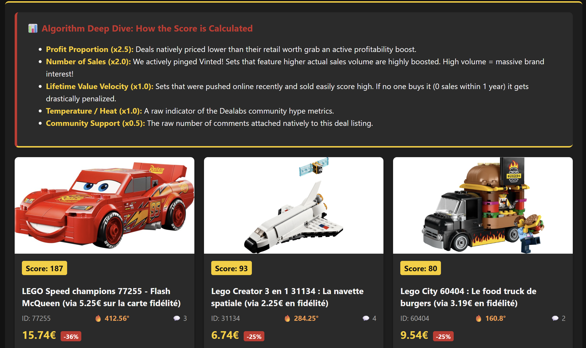
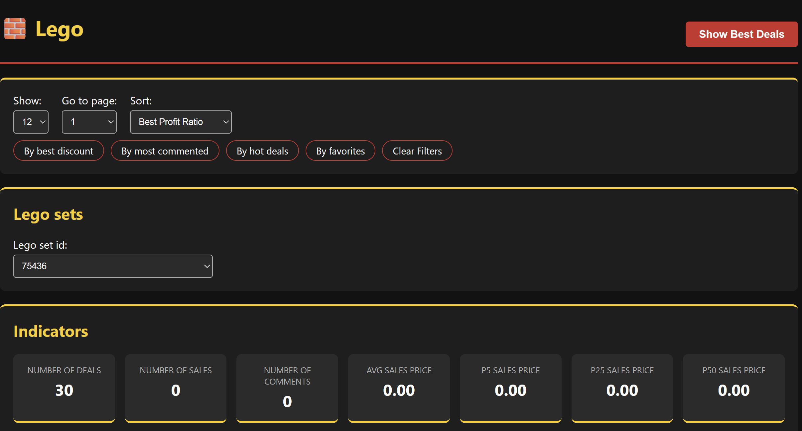

# 🧱 Lego - Predictability of a Lego Set Deal

> First bricks for profitability. An end-to-end web application to determine if a Lego set deal is really a good deal.

<!-- START doctoc generated TOC please keep comment here to allow auto update -->
<!-- DON'T EDIT THIS SECTION, INSTEAD RE-RUN doctoc TO UPDATE -->

- [📱 About The Project](#-about-the-project)
  - [Visual Rendering](#visual-rendering)
- [⚙️ Architecture & Data Pipeline](#-architecture--data-pipeline)
- [🛠️ Skills & Technologies Developed](#-skills--technologies-developed)
- [🚀 Getting Started](#-getting-started)
  - [Prerequisites](#prerequisites)
  - [Installation & Launch](#installation--launch)
- [👩🏽‍💻 Step by step Workshops](#-step-by-step-workshops)
- [📝 Licence](#-licence)

<!-- END doctoc generated TOC please keep comment here to allow auto update -->

## 📱 About The Project

LEGO investments are a well-known source of profit, but collecting that profit isn't as easy as it sounds. Identifying profitable Lego sets, buying them under retail price to maximize margins, and selling them above retail price requires a data-driven approach.

This project is a full-stack web application designed to solve this problem by providing a frictionless experience to identify profitable Lego deals in very few clicks.

### Visual Rendering




## ⚙️ Architecture & Data Pipeline

The project implements a complete data pipeline from scraping to the frontend dashboard:

1. **Web Scraping (Node.js)**: Fetching products and sales from different website sources (e.g., Dealabs for deals, Vinted for market sales).
2. **Data Storage & API (Express.js)**: Saving deals and sales locally to avoid redundant scraping and exposing them through a RESTful API.
3. **Frontend Dashboard (Vanilla JS/HTML/CSS)**: An interactive web interface to consume the API, manipulate data, and render the best deals in the browser.
4. **Deployment**: Prepared for production deployment on platforms like Vercel.

## 🛠️ Skills & Technologies Developed

This project demonstrates a comprehensive understanding of modern web development and software engineering principles:

- **Backend Development**: Node.js, Express.js, RESTful API design.
- **Web Scraping**: Data extraction from external platforms.
- **Frontend Development**: Vanilla JavaScript (ES6+), DOM manipulation, responsive HTML5/CSS3.
- **Data Engineering**: Data structures manipulation, local data storage, API pagination and filtering algorithms.
- **Software Engineering**: Modular architecture, `Makefile` for automation, separation of concerns (Client/Server).

## 🚀 Getting Started

To get a local copy up and running, follow these steps.

### Prerequisites
- Node.js
- npm

### Installation & Launch

1. **Start the API Server**:
   ```bash
   cd server
   npm install
   node api.js
   ```
   *The API will be available at `http://localhost:8092`.*

2. **Launch the Client Interface**:
   Open a new terminal and serve the frontend files.
   ```bash
   cd client/v2
   npx serve .
   ```
   *Access the dashboard via the local address provided by `serve` (usually `http://localhost:3000`).*

## 👩🏽‍💻 Step by step Workshops

The project was built progressively through the following workshops:

| Step | Workshop | Description |
| :---: | :--- | :--- |
| 0 | [Craft an effective prototype](./workshops/0-craft-your-conviction.md) | UX best practices and prototyping |
| 1 | [Manipulate data with JavaScript](./workshops/1-manipulate-javascript.md) | JS data structures and manipulation |
| 2 | [Interact data with JS, HTML, CSS](./workshops/2-interact-js-css.md) | DOM manipulation and styling |
| 3 | [Scrape data with Node.js](./workshops/3-scrape-node.md)| Fetching data from web sources |
| 4 | [Build an api with Express](./workshops/4-api-express.md) | REST API to serve the data |
| 5 | Deploy in production | Serverless deployment |

## 📝 Licence

[Uncopyrighted](http://zenhabits.net/uncopyright/)
